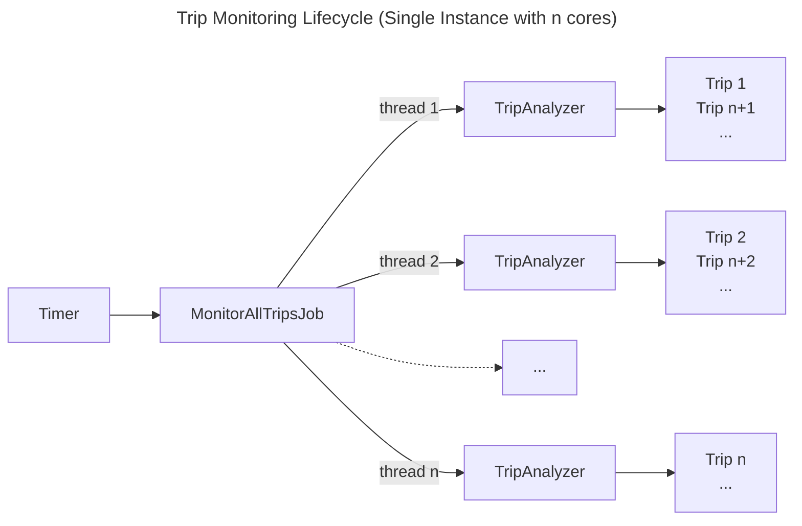
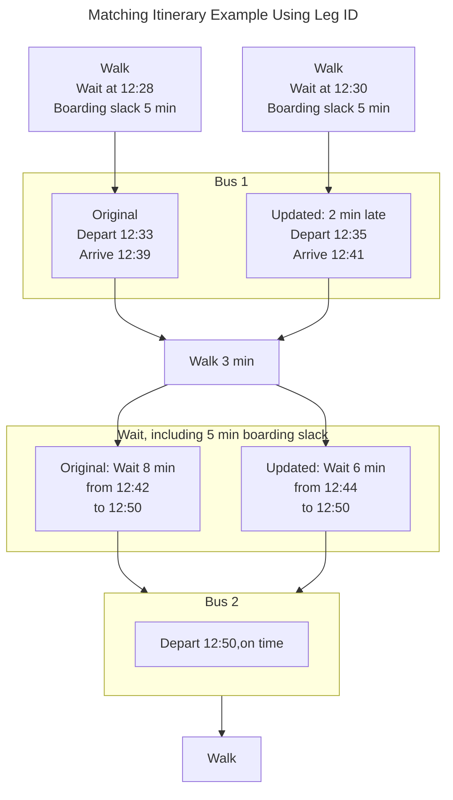
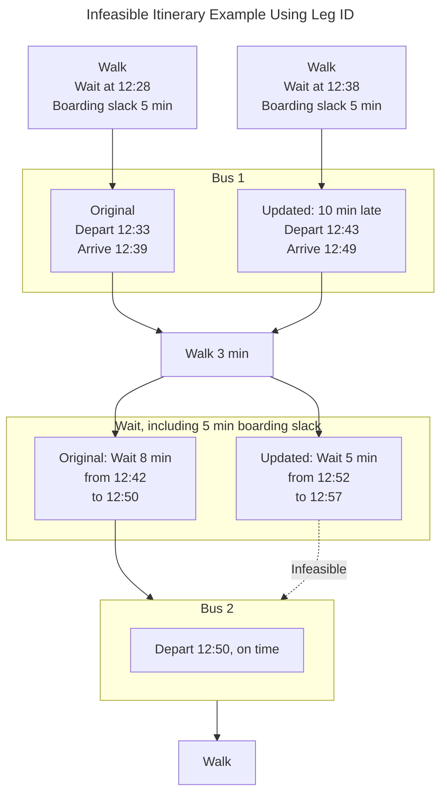

# Trip Monitoring

This file provides an overview of the trip monitoring functionality.
Trip monitoring lets users save a trip from a search in OTP and receive any real-time updates such as delays and alerts.
Trips saved by users can be retrieved at a later point for viewing/editing.

## Classes

OtpUser
MonitoredTrip
JourneyState
TripAnalyzer
CheckMonitoredTrip

## Trip Monitoring Lifecycle

Trip monitoring is run as a background, recurring job `MonitorAllTripsJob` that runs every minute.
The job splits the monitoring of all qualifying trips between threads as determined by the number of CPUs on the instance.
Each thread runs a `TripAnalyzer`, and each analyzer processes a queue of `MonitoredTrip`, one trip at a time.

Trip monitoring is currently intended to be performed by a single instance.
Running trip monitoring on multiple instances is possible, however race conditions may occur.

The trip monitoring lifecycle is illustrated in the following diagram, where the executing instance has *n* cores:

## Trip Monitoring Conditions

Class `CheckMonitoredTrip` contains the actual trip monitoring logic.
All saved trips are checked for the following conditions:

- Trip is active
- Trip is not snoozed
- Trip is one-time not in the past, or trip is recurring
- Trip is not deemed no longer possible
- Trip is being monitored on a particular day
- Trip start time is within the lead monitoring time, and the trip end time has not passed yet.

Within an hour of the trip start time, checks are performed every 15 minutes.
Within 30 minutes the trip start time, checks are performed every minute.

## Important concepts

### Target Date and Matching Itinerary

When a user saves an itinerary for monitoring, that itinerary is saved in Mongo as a template without real-time updates
or alerts. The query parameters used to obtain that itinerary are also saved, so that a request to OTP to
replan the trip can be made, if needed.

The *target date* is the date a trip is supposed to take place. For one-time trips, the target date is the date of the trip.
For recurring trips, the target date is the next occurrence of the trip, according to the days the trip is being monitored.

When monitoring real-time updates, a *matching itinerary* is fetched from OTP using the query parameters used to obtain the original itinerary.
A matching itinerary looks similar to the saved itinerary, however, the itinerary date corresponds to the target date.
Some of the times can be shifted, and real-time alerts can be present.

Whether an itinerary matches another one is determined by the `ItineraryMatcher` utility class.

### Itinerary Fetching and Matching

The `ItineraryMatcher` class uses two methods to find a matching itinerary:

#### Leg ID Method

Transit legs are fetched using OTP's `leg` query for a particular day by computing a leg id.
The leg id is a hash used by OTP to quickly lookup a leg.
A leg id combines the date, service id, and from and to places of a transit leg.
If all transit legs are found by querying leg ids, an itinerary is reconstructed by attempting to fit the
transfer legs between the fetched, updated transit legs.

When fitting transfers between updated transit legs, two things remain constant:
- The duration of transfer legs
- The transfer slack or margin between the ending time of the transfer leg and the departure time of the next transit leg.

The duration of transfer legs (and other walk/bicycle legs) is constant remains the same because the physical ability of the traveler is constant. Transfer legs are incompressible, so if a transfer between two transit vehicles requires a three-minute walk, 

Likewise, the transfer slack is a constant included to insure a traveler has enough time to get to the boarding location
of the next transit vehicle. The transfer slack is part of the routing configuration in OTP.
OTP-middleware computes that quantity from the original itinerary (departure time of the first transit leg minus arrival time of the first walk/bicycle leg).

If, after fitting the transfer legs, the wait time is more than the transfer slack, we have an updated, feasible itinerary.
If not, the itinerary is not feasible given the real-time updates.

#### Plan Method

If the leg id method fails, a `plan` query is sent to OTP to replan the entire trip for the target date, using the
query parameters of the monitored trip. This method is slower than leg id because OTP has to perform a full itinerary
search, whereas a leg id query is a simple lookup operation.
Itineraries returned from the OTP plan query are matched against the original monitored itinerary.

Two itineraries match if they meet the conditions below:
- Both itineraries can be monitored (they don't contain rentals)
- The have the same number of legs
- The origin and destination stops match
- The same modes and transit routes are used in the same order
- The transit vehicles must present the same headsign
- The same interlining between routes must be present (e.g. situations when the same vehicle continues as a different route starting from a stop)
- The start times and end times are the same.

### Journey State

The journey state contains various attributes that deal with real-time trip monitoring, including:
- Matching itinerary
- Target date and trip status (upcoming, in the past, active, trip not found)
- Latest departure and arrival delay updates
- Notifications sent, so that the same notifications are not unnecessarily repeated to users.

## Itinerary Existence Checking

Itinerary existence checking is performed prior to saving a new monitored trip.
Typically, the OTP-react-redux UI will request an itinerary check for a given itinerary.
OTP-middleware will perform an additional check upon submission (POST). If the check does not succeed,
the submission is rejected, and the trip is not saved or monitored.

## Notifications

Notifications are of the following types.
Multiple notifications for the same check are generally combined into a single notification message.

- Advance trip reminder ("Reminder for My Trip at 8:30") - Sent once at the lead monitoring time for all monitored trips on the day the trip occurs.
- Trip alerts - Sent once each new GTFS-realtime alerts attached to transit legs, and once when a previously present alert is no longer there (i.e. cleared).
- Trip delay notifications ("Your trip is departing/arriving 5 minutes late") - Sent if delays exceed 5 minutes from the original trip time.
- Loss of real-time data in OTP - Sent each time a matching itinerary is fetched and contains no real-time updates, while the previously fetched matching itinerary did.
- Unable to monitor trip - Sent when real-time conditions are so that a trip can no longer be performed because of
missed transfers or other reasons.

Trip notifications can be sent using the following channels as selected by the user in their account settings:
- Email to the account's email address, using Sparkpost
- SMS to the number stored and verified in their account, using Twilio
- Push notifications to mobile apps that subscribe to a specific AWS SNS service. A separate push middleware must be
implemented that manages registered devices and forwards notifications to them.

A notification message template (.ftl file) is provided for each notification channel,
so that notifications are formatted to fit the receiving device.
The length of the content sent via SMS can impact the amount billed by the SMS service.
Push notification content may be trimmed automatically to fit the message format of the mobile platform.
