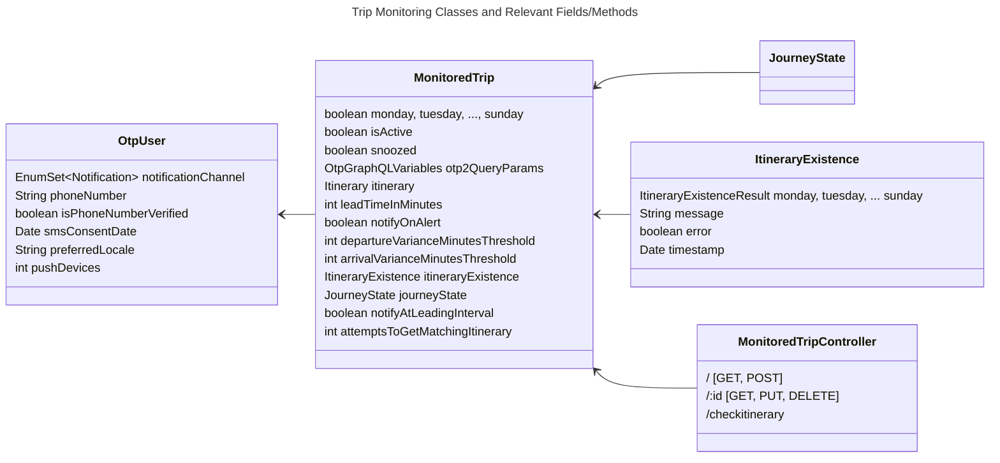
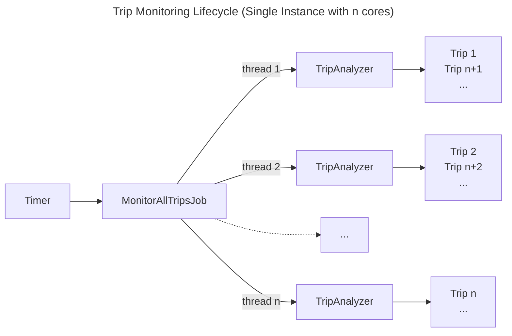

# Trip Monitoring

This file provides an overview of the trip monitoring functionality.
Trip monitoring lets users save a trip from a search in OTP and receive any real-time updates such as delays and alerts.
Trips saved by users can be retrieved at a later point for viewing/editing.

## Shortcuts to Configuration Items

- [OTP configuration](#itinerary-fetching-and-matching)
- [Email notifications](#email-notifications)
- [SMS notifications](#sms-notifications)
- [Push notifications](#push-notifications)

## Overview

TripAnalyzer
CheckMonitoredTrip

## Trip Monitoring Lifecycle

Trip monitoring is run as a background, recurring job `MonitorAllTripsJob` that runs every minute.
The job splits the monitoring of all qualifying trips between threads as determined by the number of CPUs on the instance.
Each thread runs a `TripAnalyzer`, and each analyzer processes a queue of `MonitoredTrip`, one trip at a time.

Trip monitoring is currently intended to be performed by a single instance.
Running trip monitoring on multiple instances is possible, however race conditions may occur.

The trip monitoring lifecycle is illustrated in the following diagram, where the executing instance has *n* cores:

## Trip Monitoring Conditions

Class `CheckMonitoredTrip` contains the actual trip monitoring logic.
All saved trips are checked for the following conditions:

- `MonitoredTrip.active` true,
- `MonitoredTrip.isSnoozed` not true
- Trip is one-time not in the past, or trip is recurring
- Trip is not deemed no longer possible
- Trip is being monitored on the current day of the week
- Current time is within `MonitoredTrip.leadTimeInMinutes` of the matching itinerary's start time, and that itinerary end time has not passed yet.

Within an hour of the trip start time, checks are performed every 15 minutes.
Within 30 minutes the trip start time, checks are performed every minute.

## Important concepts

### Target Date and Matching Itinerary

When a user saves an itinerary for monitoring, that itinerary is saved in Mongo as a template without real-time updates
or alerts. The query parameters used to obtain that itinerary are also saved, so that a request to OTP to
replan the trip can be made, if needed.

The *target date* is the date a trip is supposed to take place. For one-time trips, the target date is the date of the trip.
For recurring trips, the target date is the next occurrence of the trip, according to the days the trip is being monitored.
Note that holidays are not supported yet.

When monitoring real-time updates, a *matching itinerary* is fetched from OTP using the query parameters used to obtain the original itinerary.
A matching itinerary looks similar to the saved itinerary, however, the itinerary date corresponds to the target date.
Some of the times can be shifted, and real-time alerts can be present.

Whether an itinerary matches another one is determined by the `ItineraryMatcher` utility class.

### Itinerary Fetching and Matching

The `ItineraryMatcher` class uses two methods to find a matching itinerary from OTP: Leg ID and Plan.
Either one can optionally run in multiple threads if `OTP_REQUESTS_THREADING_ENABLED` is set to `true`,
independently from the threading from `MonitorAllTripsJob`.

Itinerary fetching uses the following OTP configuration parameters:

| Key | Description |
| --- | --- |
| `OTP_API_ROOT` | The URL of an operational OTP (v2.x) server. Should end with the `/otp` path. |
| `OTP_GRAPHQL_ENDPOINT` | Endpoint for OTP GraphQL queries, typically `/routers/default/index/graphql` or `/gtfs/v1` | 
| `OTP_REQUESTS_THREADING_ENABLED` | Use multi-threading to handle OTP requests and responses (default true). |
| `OTP_SERVER_REQUEST_TIMEOUT_IN_SECONDS` | The maximum time for making requests to OTP (default 30s) |
| `OTP_TIMEZONE` | The timezone identifier (e.g. `America/Los_Angeles`) that OTP is using to parse dates and times. |
| `OTP_TRANSFER_SLACK_SECONDS` | Optional extra time added by OTP between two transit legs to ensure transfers can be made, accounting for small timing variations that happen in reality. |
| `PLAN_QUERY_RESOURCE_URI` | Optional location of a custom GraphQL template for the OTP `plan` query.  |
| `MAXIMUM_MONITORED_TRIP_ITINERARY_CHECKS` | The maximum number of attempts to obtain a matching itinerary (default 3). Used with `MonitoredTrip.attemptsToGetMatchingItinerary`. |

#### Leg ID Method

Transit legs are fetched using OTP's `leg` GraphQL query for a particular day.
Returned legs, if found, contain rela-time delays or alerts.
Legs are queried using a leg id, which is a hash used by OTP to quickly lookup a leg.
A leg id combines the date, service id, and from and to places of a transit leg.

If all transit legs are found by querying leg ids, an itinerary is reconstructed by attempting to fit the
transfer legs between the fetched, updated transit legs.
There are two constraints in that process:

- Transfer legs
: The duration of transfer legs (and other walk/bicycle legs) does not change because the physical ability
of travelers is constant. A three-minute walk to transfer between two transit routes is thus preserved while reconstructing the itinerary.

- Slack or margins before, between, and after transit legs.
: Slacks are constants that ensure a traveler has enough time to get to the boarding location
of the next transit vehicle. Slacks are part of the OTP routing configuration.
From the original itinerary, OTP-middleware can compute:

  - the boarding slack (minimum time between the end of a walk leg and the start of the next transit leg)
  - the alighting slack (minimum time between the end of a transit leg and the start of the next walk leg)
  
If an additional transfer slack is configured in OTP, it must also be configured in OTP-middleware using the
`OTP_TRANSFER_SLACK_SECONDS` configuration parameter.

If, after fitting the transfer legs, the wait time is more than the transfer slack, we have an updated, feasible itinerary.
If not, the itinerary is not feasible given the real-time updates (see diagram below).

```mermaid
gantt
    title Itinerary Matching Using Leg ID
    dateFormat HH:mm
    axisFormat %H:%M
    section Original Itinerary
        Walk : 12:10, 12:18
        Slack : 5m
        Bus 1: 12:23, 12:39
        Walk : 3m
        Slack : 5m
        Bus 2: 12:50, 13:00
    section Updated, Feasible Itinerary
        Walk : 12:12, 12:20
        Slack : 5m
        Bus 1, 2 min late: 12:25, 12:41
        Walk : 3m
        Slack: 5m
        Bus 2, on time: 12:50, 13:00
    section Updated, Infeasible Itinerary
        Walk : 12:20, 12:28
        Slack : 5m
        Bus 1, 10 min late: 12:33, 12:49
        Walk : crit, 3m
        Slack: crit, 5m
        Bus 2, on time: 12:50, 13:00
```

#### Plan Method

If the leg id method fails, a `plan` GraphQL query is sent to OTP to replan the entire trip for the target date, using
`MonitoredTrip.otp2QueryParams`. This method is slower than leg id method because OTP has to perform a full itinerary
search, whereas a leg id query is a simple lookup operation.
Itineraries returned from the OTP plan query are stripped from delay data and matched against the original monitored itinerary.

Two itineraries match if they meet the conditions below:
- Both itineraries can be monitored (they don't contain rentals)
- The have the same number of legs
- The origin and destination stops match
- The same modes and transit routes are used in the same order
- The transit vehicles must present the same headsign
- The same interlining between routes must be present (e.g. situations when the same vehicle continues as a different route starting from a stop)
- The start times and end times are the same.

Note that suggesting alternate itineraries is not implemented yet.

#### Itinerary Matching Attempts

In case no matching itinerary is found using either method above, or there is a connection timeout,
the process can be re-attempted at the next run of `MonitorAllTripsJob`,
up to the number of attempts set by `MAXIMUM_MONITORED_TRIP_ITINERARY_CHECKS`.

The number of consecutive failed attempts is recorded in `MonitoredTrip.attemptsToGetMatchingItinerary`.
If the number of attempts is reached and a matching itinerary is not found, a notification of type `ITINERARY_NOT_FOUND`
("Unable to monitor trip") is sent.

### Journey State

The journey state contains various attributes that deal with real-time trip monitoring, including:
- Matching itinerary
- Target date and trip status (upcoming, in the past, active, trip not found)
- Latest departure and arrival delay updates
- Notifications sent, so that the same notifications are not unnecessarily repeated to users.

## Itinerary Existence Checking

Itinerary existence checking is handled by the `/checkitinerary` (POST) endpoint of `MonitoredTripController`.
The endpoint takes a `MonitoredTrip` object with a populated `itinerary` and `otp2QueryParams` fields.

The itinerary existence check queries OTP and tries to find matching itineraries in a seven-day window
that starts from `MonitoredTrip.otp2QueryParams.date`.
The result is an `ItineraryExistence` object with fields for each day of the week (monday, ..., sunday),
each day containing a valid flag, valid and invalid dates.

Itinerary existence should be checked prior to saving a new monitored trip.
Typically, the OTP-react-redux UI will request an existence check for a given itinerary
and display the days of the week the itinerary is possible.

Upon saving a trip (POST), if the trip is recurring, OTP-middleware will perform an additional existence check. If the check does not succeed,
the request is rejected, and the trip is not saved or monitored. If the check passes,
the result is saved in `MonitoredTrip.itineraryExistence`.
(The check is not performed when saving one-time trips.)

## Trip Notifications

Trip notifications are of the following types.
Multiple notifications from a single run of `CheckMonitoredTrip` are generally combined into a single
notification message.

| Notification Type | Description |
| --- | --- |
| `INITIAL_REMINDER` | Advance trip reminder ("Reminder for My Trip at 8:30"). If `MonitoredTrip.notifyAtLeadingInterval` is true, sent once at the lead monitoring time on the day a given trip occurs. |
| `ALERT_FOUND` | Trip alerts - If `MonitoredTrip.notifyOnAlert` is true, an alert is sent once for each new GTFS-realtime alert in the matching itinerary, and once when a previously present alert is no longer there (i.e. cleared). |
| `DEPARTURE_DELAY` `ARRIVAL_DELAY` `DEPARTURE_AND_ARRIVAL_DELAY` | Trip delay notifications ("Your trip is departing/arriving 5 minutes late") - Sent if delays exceed 5 minutes from the original trip time. |
| `REALTIME_UPDATES_LOST` | Loss of real-time data in OTP - Sent each time a matching itinerary is fetched and contains no real-time updates, while the previously fetched matching itinerary did. |
| `ITINERARY_NOT_FOUND` | "Unable to monitor trip" - Sent when a trip can no longer be performed, for instance because of a schedule change or real-time conditions resulting in missed transfers. |

Other notifications are discussed in [Notifications to Companions/Observers](live-tracking.md#notifications-to-companionsobservers).

Trip notifications are sent using the channels set in `OtpUser.notificationChannel`, which is a combination of
`EMAIL`, `SMS`, `PUSH` defined in enum `OtpUser.Notification`. `HAPTIC` is reserved for mobile app use and is not
handled by OTP-middleware.
The notification language/locale is set in `OtpUser.preferredLocale` at the time notifications are sent.

Message templates in [Freemarker](https://freemarker.apache.org/) format (.ftl files) are provided for each notification
channel and each supported language, so that notifications are formatted to fit the receiving device.

###  Email notifications

Email notifications are sent with [Sparkpost (now known as Bird Email)](https://bird.com/en/resources/blog/sparkpost-is-now-bird-email).
The destination email is the email a user entered when creating an OTP-middleware account using Auth0.
It is recommended to verify the email address by having users open a link sent to them by Auth0
(`Auth0Users.resendVerificationEmail` method).
OTP-middleware uses Auth0 login data to extract the user's email and does not store it.

The email configuration parameters are as follows:

| Key | Description |
| --- | --- |
| `NOTIFICATION_FROM_EMAIL` | The `from` email address used in notification emails, e.g. `OTP Middleware <no-reply@example.com>`. The domain name of this address must be whitelisted in the Sparkpost dashboard, otherwise, messages are not sent. |
| `SPARKPOST_KEY` | Get Sparkpost key at: https://app.sparkpost.com/account/api-keys |
| `OTP_UI_NAME` | Contains the name of the trip planner, used in the email footer |
| `OTP_UI_URL` | The URL of the trip planner, used in the email footer |

### SMS Notifications

SMS notifications are sent to the number stored in `OtpUser.phoneNumber`, using [Twilio](https://www.twilio.com/).
The phone number must be verified (`OtpUser.isPhoneNumberVerified`, ),
typically using a UI where the user enters a Twilio validation code sent to that number.

Because cell phone carriers often charge fees for SMS, it is recommended to record the user's consent date
for SMS communications using `OtpUser.smsConsentDate`.

Content for SMS notifications should fit in 160 characters. Contents above that limit is
[split into multiple messages](https://www.twilio.com/docs/glossary/what-sms-character-limit),
each billed separately.

The SMS configuration parameters are as follows:

| Key | Description |
| --- | --- |
| `NOTIFICATION_FROM_PHONE` | The phone number that users will see SMS messages coming from. That number must be whitelisted in the Twilio dashboard, otherwise SMS messages are not sent. |
| `TWILIO_ACCOUNT_SID` `TWILIO_AUTH_TOKEN` `TWILIO_VERIFICATION_SERVICE_SID` | Twilio settings available at: https://twilio.com/user/account |

### Push Notifications

Push notifications can be sent to mobile apps that subscribe to a specific AWS SNS service.
A separate push middleware must be implemented (not documented here) that manages registered devices
and forwards notifications to them.
The number of registered devices is available in `OtpUser.pushDevices`.

Push configuration parameters are as follows:

| Key | Description |
| --- | --- |
| `PUSH_API_KEY` | Key for Mobile Team push notifications internal API. |
| `PUSH_API_URL` | URL for Mobile Team push notifications internal API, in the form https://example.com/api/otp_push/instance_name. |

Push notification content is trimmed automatically to fit the message format of the mobile platform.
Only one notification sent, and contents that exceeds the limits below will not be split into multiple notifications.

| Character limit for... | Android | iOS | All Push Notifications |
| --- | --- | --- | --- |
| Notification title | 65 | None | 65 |
| Notification total length (title + message) | 240 | 178 | 178 |
