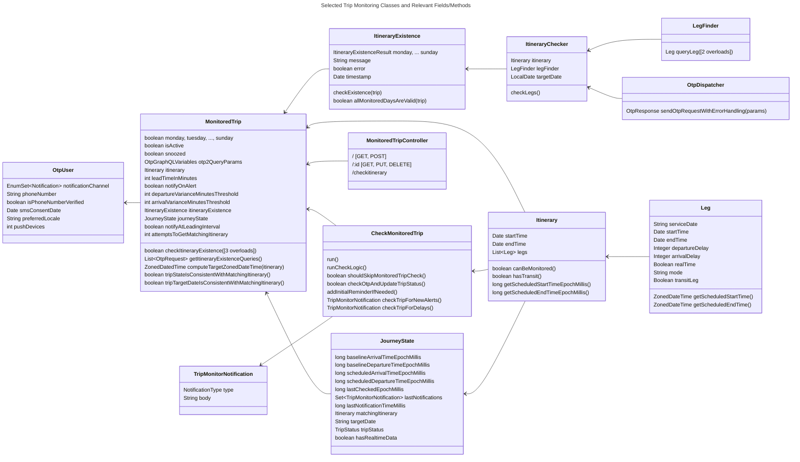
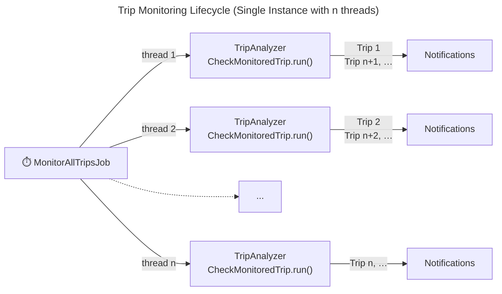
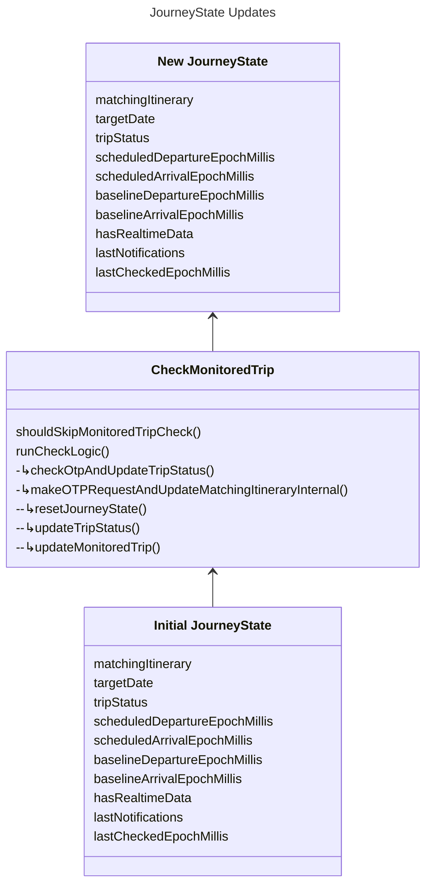

# Trip Monitoring

Trip monitoring lets users save an itinerary searched in OTP and receive any real-time updates such as delays and alerts
regarding that itinerary. Users can retrieve monitored trips at a later point for viewing/editing.

## Shortcuts to Configuration Items

- [OTP configuration](#itinerary-fetching-and-matching)
- [Email notifications](#email-notifications)
- [SMS notifications](#sms-notifications)
- [Push notifications](#push-notifications)

## Class Overview



## Trip Monitoring Lifecycle

Trip monitoring is orchestrated by
[`MonitorAllTripsJob`](../src/main/java/org/opentripplanner/middleware/tripmonitor/jobs/MonitorAllTripsJob.java)
that runs every minute in the background. The job splits the monitoring of all qualifying trips between threads
as determined by the number of CPUs on the instance. Each thread runs a
[`TripAnalyzer`](../src/main/java/org/opentripplanner/middleware/tripmonitor/jobs/TripAnalyzer.java)
instance that processes a queue of 
[`MonitoredTrip`](../src/main/java/org/opentripplanner/middleware/models/MonitoredTrip.java), one trip at a time.

The trip monitoring lifecycle is illustrated in the following diagram:



Trip monitoring is currently intended to be performed by a single server.
Running trip monitoring on multiple servers is possible, however race conditions may occur.
This is because when a trip is being analyzed, a thread-safe in-memory lock is set on the trip so that other threads
running on the same machine don't repeat the trip monitoring work already ongoing. The lock is released when trip
monitoring logic completes.

> [!NOTE]
> At the time of writing, the memory lock does not apply across multiple machines (a database lock would be needed).

## Trip Monitoring Conditions

The actual trip monitoring logic is contained in the
[`CheckMonitoredTrip`](../src/main/java/org/opentripplanner/middleware/tripmonitor/jobs/CheckMonitoredTrip.java) class
and is triggered by calling `CheckMonitoredTrip.run()` from a `TripAnalyzer`.

The basic steps of monitoring a trip are:
1. Checking that a trip should/should not be skipped
2. Finding the target date and matching itinerary
3. Looking for any delays or alerts
4. Send notifications

To avoid unnecessary processing, the monitoring of a trip is skipped if:

- `CheckMonitoredTrip.shouldSkipMonitoredTripCheck()` returns `true`, namely if:
  - `MonitoredTrip.active` is false,
  - `MonitoredTrip.isSnoozed` is true (trips snoozed the previous day are unsnoozed)
  - Trip is one-time in the past
  - Trip is deemed `NO_LONGER_POSSIBLE`
  - Trip is not being monitored on the current day of the week
  - Current time is before `MonitoredTrip.leadTimeInMinutes` on the day that a trip is monitored.
  Within an hour of the trip start time, checks are performed every 15 minutes.
  Within 30 minutes the trip start time, checks are performed every minute.
- the journey state and target dates are not consistent with the last matching itinerary saved:
  - `MonitoredTrip.tripStateIsConsistentWithMatchingItinerary()` returns `false`.
  - `MonitoredTrip.tripTargetDateIsConsistentWithMatchingItinerary()` returns `false`.

If trip monitoring is not skipped, method `CheckMonitoredTrip.runCheckLogic()` is executed that calls
OTP (`checkOtpAndUpdateTripStatus()`) to fetch an itinerary with real-time updates (the matching itinerary).

## Important Concepts

### Recurring vs. One-Time Trips

A recurring trip is a trip that is taken repeatedly, at least once a week.
At least one of the `MonitoredTrip.monday`...`MonitoredTrip.sunday` fields is set to true for a trip to be recurring.
If all of these fields are set to false, the trip is deemed one-time.

One-time trips are only monitored on the day they occur until they end.
After a recurring trip ends, the next date for that trip is computed, and monitoring for that trip resumes on that date.

### Target Date and Matching Itinerary

When a user saves an itinerary for monitoring, a new `MonitoredTrip` instance is created, and that itinerary is written
under `MonitoredTrip.itinerary` as a template without real-time updates
or alerts. The query parameters used to obtain that itinerary are also saved under `MonitoredTrip.otp2QueryParameters`,
so that a request to OTP to replan the trip can be made, if needed.
The `MonitoredTrip` instance is persisted in Mongo.

The **target date** (`MonitoredTrip.journeyState.targetDate`) is the date a trip is supposed to take place.
It is computed using `MonitoredTrip.computeTargetZonedDateTime()` This method does take in a matching itinerary
to prevent the target date from being changed while the matching itinerary is still ongoing.
For one-time trips, the target date is simply the date of the trip. For recurring trips, the target date is the next
occurrence of the trip, based on the days the trip is being monitored.

> [!NOTE]
> Holidays are not yet supported for trip monitoring.

During trip monitoring, a **matching itinerary** is fetched from OTP using the query parameters from which the original
itinerary was obtained. A matching itinerary looks similar to the saved itinerary, however, the itinerary date
corresponds to the target date, trip times can be shifted due to service delays, and real-time alerts can be present.

### Itinerary Fetching and Matching

Itinerary fetching uses the following OTP configuration parameters:

| Key | Description |
| --- | --- |
| `OTP_API_ROOT` | The URL of an operational OTP (v2.x) server. Should end with the `/otp` path. |
| `OTP_GRAPHQL_ENDPOINT` | Endpoint for OTP GraphQL queries, typically `/routers/default/index/graphql` or `/gtfs/v1` | 
| `OTP_REQUESTS_THREADING_ENABLED` | Use multi-threading to handle OTP requests and responses (default true), independently of the threading from `MonitorAllTripsJob` |
| `OTP_SERVER_REQUEST_TIMEOUT_IN_SECONDS` | The maximum time for making requests to OTP (default 30s) |
| `OTP_TIMEZONE` | The timezone identifier (e.g. `America/Los_Angeles`) that OTP is using to parse dates and times. |
| `OTP_TRANSFER_SLACK_SECONDS` | Optional extra time added by OTP between two transit legs to ensure transfers can be made, accounting for small timing variations that happen in reality. See OTP's [`transferSlack`](https://github.com/opentripplanner/OpenTripPlanner/blob/dev-2.x/doc/user/RouteRequest.md#transferslack) configuration parameter. |
| `PLAN_QUERY_RESOURCE_URI` | Optional location of a custom GraphQL template for the OTP `plan` query.  |
| `MAXIMUM_MONITORED_TRIP_ITINERARY_CHECKS` | The maximum number of attempts to obtain a matching itinerary (default 3). Used with `MonitoredTrip.attemptsToGetMatchingItinerary`. |

The [`ItineraryExistence`](../src/main/java/org/opentripplanner/middleware/models/ItineraryExistence.java)`.checkExistence`
and function uses two methods to find a matching itinerary from OTP: Leg ID and Plan.

#### Leg ID Method

The [`ItineraryChecker`](../src/main/java/org/opentripplanner/middleware/itinerarymatching/ItineraryChecker.java) class
and [`LegFinder`](../src/main/java/org/opentripplanner/middleware/otp/LegFinder.java) class
contain the logic for the Leg ID method. Transit legs are fetched using
[OTP's `leg` GraphQL query](https://docs.opentripplanner.org/api/dev-2.x/graphql-gtfs/queries/leg) by passing a leg ID
corresponding to a particular day. An example OTP `leg` GraphQL query is as follows.
The returned leg for a given query, if found, contain real-time delays or alerts.
```
query ($legId: String!) {
    leg(id: $legId) {
        id
        startTime
        endTime
        departureDelay
        arrivalDelay
        realTime
        alerts {
            alertDescriptionText
            alertHeaderText
            alertUrl
            effectiveStartDate
        }
        <other fields>
    }
}
```

A leg ID is a hash used by OTP to quickly look up a leg.
A leg ID combines the date, service ID, and from and to places of a transit leg.

Desired leg IDs are computed for the next or current day that a monitored trip occurs, using the leg IDs
of the itinerary originally saved. The
[`LegIdProcessor`](../src/main/java/org/opentripplanner/middleware/itinerarymatching/LegIdProcessor.java)
class contains methods for computing such leg IDs.

If all transit legs are found by querying leg IDs, an itinerary is reconstructed
([`ItineraryFromLegMatcher`](../src/main/java/org/opentripplanner/middleware/itinerarymatching/ItineraryFromLegMatcher.java)
class) by attempting to fit the transfer legs between the fetched, updated transit legs.
There are two constraints in that process:

- **Transfer leg durations are fixed**<br>
This is because someone's physical ability to walk is constant.
A three-minute walk to transfer between two given transit routes is thus preserved while reconstructing the itinerary.

- **Padding/slack before, between, and after transit legs**<br>
These constants ensure a traveler has enough time to exit a vehicle and go to the boarding location
of the next transit vehicle (see diagram below). In OTP, these are known as
[`boardSlack`](https://github.com/opentripplanner/OpenTripPlanner/blob/dev-2.x/doc/user/RouteRequest.md#boardslack),
[`alightSlack`](https://github.com/opentripplanner/OpenTripPlanner/blob/dev-2.x/doc/user/RouteRequest.md#alightslack), and
[`transferSlack`](https://github.com/opentripplanner/OpenTripPlanner/blob/dev-2.x/doc/user/RouteRequest.md#transferslack).

OTP-middleware can guess the `board-` and `alightSlack` from the original itinerary because they occur immediately
before/after the first transit leg. The transfer slack is not obvious to guess because, most often,
the wait between transit legs is in excess of the transfer slack. Therefore, if
`transferSlack` is configured in OTP, it must also be configured in
OTP-middleware using the `OTP_TRANSFER_SLACK_SECONDS` parameter.

> [!NOTE]
> OTP's mode-specific slacks are not supported yet in OTP-middleware.

```mermaid
gantt
    title Boarding, Alighting, and Transfer Slacks
    dateFormat HH:mm
    axisFormat %H:%M
    section Walk
        Walk: 12:14, 12:18
        Boarding Slack 5min: crit, 5m
        Wait: 12:18, 12:23
    section Bus 1
        Bus 1: 12:23, 12:35
    section Transfer
        Alighting Slack 3min: crit, 3m
        Walk: crit, 6m
        Transfer Slack 2min: crit, 2m
        Wiggle Room: 12:46, 12:55
        Boarding Slack 5min: crit, 12:55, 13:00
    Wait: 12:44, 13:00
    section Bus 2
        Bus 2: 13:00, 13:10
```



If, after fitting the transfer legs, the wait time is more than the transfer slack, we have an updated, feasible itinerary.
If not, the itinerary is not feasible given the real-time updates (see diagram below).

```mermaid
gantt
    title Itinerary Matching Using Leg ID
    dateFormat HH:mm
    axisFormat %H:%M
    section Original Itinerary
        Walk : 12:10, 12:18
        Slack : 5m
        Bus 1: 12:23, 12:39
        Walk : 3m
        Slack : 5m
        Bus 2: 12:50, 13:00
    section Updated, Feasible Itinerary
        Walk : 12:12, 12:20
        Slack : 5m
        Bus 1, 2 min late: 12:25, 12:41
        Walk : 3m
        Slack: 5m
        Bus 2, on time: 12:50, 13:00
    section Updated, Infeasible Itinerary
        Walk : 12:20, 12:28
        Slack : 5m
        Bus 1, 10 min late: 12:33, 12:49
        Walk : crit, 3m
        Slack: crit, 5m
        Bus 2, on time: 12:50, 13:00
```



The Leg ID method will fail if either
- not all legs can be retrieved using the `leg` OTP query. This can happen with GTFS feeds using different trip ids
for similar trips with the same stops and stop times (e.g. the same 8:00am bus weekday trip uses `trip_id_1` on Monday
and `trip_id_2` on Tuesday).
- not all transfer legs can be fitted between transit legs because of delays, as explained above.

#### Plan Method

If the Leg ID method fails,
an [OTP's `plan` GraphQL query](https://docs.opentripplanner.org/api/dev-2.x/graphql-gtfs/queries/plan) is sent to OTP
using the [`OtpDispatcher`](../src/main/java/org/opentripplanner/middleware/otp/OtpDispatcher.java) class
to replan the entire trip for the target date, using
`MonitoredTrip.otp2QueryParams`. This method is slower than the Leg ID method because OTP has to perform a full itinerary
search, whereas a `leg` query is a simple lookup operation.
Itineraries returned from OTP are stripped from delay data and matched against the original monitored itinerary.

Two itineraries match if they meet the conditions below defined in 
[`ItineraryMatcher`](../src/main/java/org/opentripplanner/middleware/itinerarymatching/ItineraryMatcher.java) and
[`LegMatcher`](../src/main/java/org/opentripplanner/middleware/itinerarymatching/LegMatcher.java) classes:
- Both itineraries can be monitored (no bicycle/scooter rentals) (`Itinerary.canBeMonitored()`)
- They have the same number of legs
- The origin and destination stops match
- The same modes and transit routes are used in the same order
- The transit vehicles must present the same headsign
- The same interlining between routes must exist (where the same vehicle continues as a different route at a terminus)
- The start times and end times are the same.

> [!NOTE]
> Suggesting alternate itineraries if no matching itinerary is found is not implemented yet.

#### Itinerary Matching Attempts

In case no matching itinerary is found using either method above, or there is an internet connection timeout,
the process can be re-attempted at the next run of `MonitorAllTripsJob`,
up to the number of attempts set by `MAXIMUM_MONITORED_TRIP_ITINERARY_CHECKS`.

The number of consecutive failed attempts is recorded in `MonitoredTrip.attemptsToGetMatchingItinerary`.
If the number of attempts is reached and a matching itinerary is not found, a notification of type `ITINERARY_NOT_FOUND`
("Unable to monitor trip") is sent.

> [!NOTE]
> A provision exists in the `CheckMonitorTrip` logic, so that a notification that a trip is no longer possible is sent
> if no matching itinerary has been found for over a week. (This is not currently implemented.)

### Journey State

Each `MonitoredTrip` object contains a
[`JourneyState`](../src/main/java/org/opentripplanner/middleware/tripmonitor/JourneyState.java)
instance, which is a snapshot of the latest trip monitoring state as a result of
running `CheckMonitoredTrip`. If a `JourneyState` object's fields are not populated (or are zero),
the trip is deemed to not have been monitored before.



Once an occurrence of a trip completes, the journey state is "reset" (`ChackMonitoredTrip.resetJourneyState()`),
so that notifications can be sent again for the next trip occurrence.

A `JourneyState` consists of the following attributes:

- `matchingItinerary` with any real-time updates
- `targetDate` of the next occurrence of a monitored trip
- `tripStatus` of the current or next occurrence of a monitored trip
- `scheduled{arrival/departure}TimeEpochMillis` contains the scheduled trip start/end times (in millis) for the `targetDate`.
- `baseline{arrival/departure}TimeEpochMillis` and `hasRealtimeData` contains the most recent updated trip start/end times (in millis) for the matching itinerary.
- `lastNotifications` (and `lastNotificationTimeMillis`) holds all notifications sent , so that the same notifications are not unnecessarily repeated to users.
- `lastCheckedEpochMillis` used to space out checks within 30 minutes and one hour before trip starts.

The possible values for `tripStatus` are as follows:

| `TripStatus` value | Description |
| --- | --- |
| `TRIP_UPCOMING` | A matching itinerary was found at the last run of `CheckMonitoredTrip` before the start time of next occurrence of the trip |
| `TRIP_ACTIVE` | The current time is after the start time and before the end time of the matching itinerary most recently fetched |
| `PAST_TRIP` | Indicates a one-time trip that happened in the past |
| `NEXT_TRIP_NOT_POSSIBLE` | No matching itinerary has been found for the next occurrence of the trip |
| `NO_LONGER_POSSIBLE` | (Not used) No matching itinerary has been found in a week |

## Itinerary Existence Checking

Itinerary existence checking is handled by the `/checkitinerary` (POST) endpoint of 
[`MonitoredTripController`](../src/main/java/org/opentripplanner/middleware/controllers/api/MonitoredTripController.java).
The endpoint takes a `MonitoredTrip` object with a populated `itinerary` and `otp2QueryParams` fields.
Internally, the controller calls `MonitoredTrip.checkItineraryExistence()` without replacing/overwriting the saved itinerary.

The itinerary existence check queries OTP and tries to find matching itineraries in a seven-day window
that starts from `MonitoredTrip.otp2QueryParams.date`. The queries are derived from `MonitoredTrip.otp2QueryParams`
in method `MonitoredTrip.getItineraryExistenceQueries()`.

The result is an
[`ItineraryExistence`](../src/main/java/org/opentripplanner/middleware/models/ItineraryExistence.java) object
with fields for each day of the week (`monday`, ..., `sunday`),
each day containing a valid flag, valid and invalid dates.

Itinerary existence should be checked prior to saving a new monitored trip.
Typically, the OTP-react-redux UI will request an existence check for a given itinerary
and display the days of the week the itinerary is possible.

Upon saving a trip (POST), if the trip is recurring, OTP-middleware will perform an additional existence check.
If the check does not succeed, the request is rejected, and the trip is not saved or monitored. If the check passes,
the result is saved in `MonitoredTrip.itineraryExistence`.

> [!NOTE]
> The check is not performed when saving one-time trips.

## Trip Notifications

In the `CheckMonitoredTrip.runCheckLogic()` method, after obtaining a matching itinerary from OTP,
trip notifications are generated by comparing `MonitoredTrip.journeyState.matchingItinerary` to `MonitoredTrip.itinerary`.
Trip notifications are of the following types:

| Notification Type | Description |
| --- | --- |
| `INITIAL_REMINDER` | Advance trip reminder ("Reminder for My Trip at 8:30"). If `MonitoredTrip.notifyAtLeadingInterval` is true, sent once at the lead monitoring time on the day a given trip occurs, using `CheckMonitoredTrip.addInitialReminderIfNeeded()`. |
| `ALERT_FOUND` | Trip alerts - If `MonitoredTrip.notifyOnAlert` is true, an alert is sent once for each new GTFS-realtime alert in the matching itinerary, and once when a previously present alert is no longer there (i.e. cleared), per `CheckMonitoredTrip.checkTripForNewAlerts()`. |
| `DEPARTURE_DELAY`<br>`ARRIVAL_DELAY`<br>`DEPARTURE_AND_ARRIVAL_DELAY` | Trip delay notifications ("Your trip is departing/arriving 5 minutes late") - Sent if delays from the original trip exceed the threshold in minutes defined by `MonitoredTrip.departureVarianceMinutesThreshold` or `MonitoredTrip.arrivalVarianceMinutesThreshold` for departure or arrival delays, respectively, per `CheckMonitoredTrip.checkTripForDelays`. |
| `REALTIME_UPDATES_LOST` | Loss of real-time data in OTP - Sent each time a matching itinerary is fetched and contains no real-time updates, whereas the previously fetched matching itinerary did. |
| `ITINERARY_NOT_FOUND` | "Unable to monitor trip" - Sent when a trip can no longer be performed, for instance because of a schedule change or real-time conditions resulting in missed transfers. |

Other notifications are discussed in [Notifications to Companions/Observers](live-tracking.md#notifications-to-companionsobservers).

Trip notifications are sent to the [`OtpUser`](../src/main/java/org/opentripplanner/middleware/models/OtpUser.java)
using the channels set in `OtpUser.notificationChannel`, which is a combination of
`OtpUser.Notification.EMAIL`, `SMS`, and `PUSH` enum members. `HAPTIC` is reserved for mobile app use.
The notification language/locale is set in `OtpUser.preferredLocale` at the time notifications are sent.

To avoid sending repeat notifications, sent notifications are persisted in `MonitoredTrip.journeyState.lastNotifications`.
If a notification with the same type and body already exists in `lastNotifications`, the notification is not sent.

Message templates in [Freemarker](https://freemarker.apache.org/) format (.ftl files) are provided for each notification
channel and each supported language, so that notifications are formatted to fit the receiving device.
The templates can accommodate multiple notifications from a single run of `CheckMonitoredTrip` into a single message.

###  Email Notifications

Email notifications are sent with [Sparkpost (now known as Bird Email)](https://bird.com/en/resources/blog/sparkpost-is-now-bird-email).
The destination email is the email a user entered when creating an OTP-middleware account using Auth0.
It is recommended to verify the email address by sending users an Auth0 verification link they can open
([`Auth0Users`](../src/main/java/org/opentripplanner/middleware/auth/Auth0Users.java)`.resendVerificationEmail` method).
OTP-middleware uses Auth0 login data to extract the user's email and does not store it.

The email configuration parameters are as follows:

| Key | Description |
| --- | --- |
| `NOTIFICATION_FROM_EMAIL` | The `from` email address used in notification emails, e.g. `OTP Middleware <no-reply@example.com>`. The domain name of this address must be whitelisted in the Sparkpost dashboard, otherwise, messages are not sent. |
| `SPARKPOST_KEY` | Get Sparkpost key at: https://app.sparkpost.com/account/api-keys |
| `OTP_UI_NAME` | Contains the name of the trip planner, used in the email footer |
| `OTP_UI_URL` | The URL of the trip planner, used in the email footer |

### SMS Notifications

SMS notifications are sent to the number stored in `OtpUser.phoneNumber`, using [Twilio](https://www.twilio.com/).
The phone number must be verified (`OtpUser.isPhoneNumberVerified`),
typically using a UI where the user enters a Twilio validation code sent to that number.

Because cell phone carriers often charge fees for SMS, it is recommended to record the user's consent date
for SMS communications using `OtpUser.smsConsentDate`.

Content for SMS notifications should fit in 160 characters. Contents above that limit is
[split into multiple messages](https://www.twilio.com/docs/glossary/what-sms-character-limit),
each billed separately.

The SMS configuration parameters are as follows:

| Key | Description |
| --- | --- |
| `NOTIFICATION_FROM_PHONE` | The phone number that users will see SMS messages coming from. That number must be whitelisted in the Twilio dashboard, otherwise SMS messages are not sent. |
| `TWILIO_ACCOUNT_SID`<br>`TWILIO_AUTH_TOKEN`<br>`TWILIO_VERIFICATION_SERVICE_SID` | Twilio settings available at: https://twilio.com/user/account |

### Push Notifications

Push notifications can be sent to mobile apps that subscribe to a specific AWS SNS service.
A separate push middleware must be implemented (not documented here) that manages registered devices
and forwards notifications to them.
The number of registered devices is available in `OtpUser.pushDevices`.

Push configuration parameters are as follows:

| Key | Description |
| --- | --- |
| `PUSH_API_KEY` | Key for Mobile Team push notifications internal API. |
| `PUSH_API_URL` | URL for Mobile Team push notifications internal API, in the form https://example.com/api/otp_push/instance_name. |

Push notification content is trimmed automatically to fit the message format of the mobile platform.
Only one notification sent, and contents that exceeds the limits below will not be split into multiple notifications.

| Character limit for... | Android | iOS | All Push Notifications |
| --- | --- | --- | --- |
| Notification title | 65 | None | 65 |
| Notification total length (title + message) | 240 | 178 | 178 |
