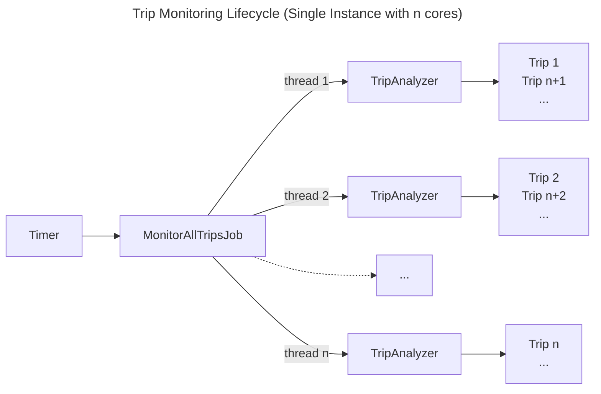

# Trip Monitoring

This file provides an overview of the trip monitoring functionality.
Trip monitoring lets users save a trip from a search in OTP and receive any real-time updates such as delays and alerts.
Trips saved by users can be retrieved at a later point for viewing/editing.

## Classes

OtpUser
MonitoredTrip
JourneyState
TripAnalyzer
CheckMonitoredTrip

## Trip Monitoring Lifecycle

Trip monitoring is run as a background, recurring job `MonitorAllTripsJob` that runs every minute.
The job splits the monitoring of all qualifying trips between threads as determined by the number of CPUs on the instance.
Each thread runs a `TripAnalyzer`, and each analyzer processes a queue of `MonitoredTrip`, one trip at a time.

Trip monitoring is currently intended to be performed by a single instance.
Running trip monitoring on multiple instances is possible, however race conditions may occur.

The trip monitoring lifecycle is illustrated in the following diagram, where the executing instance has *n* cores:

## Trip Monitoring Conditions

Class `CheckMonitoredTrip` contains the actual trip monitoring logic.
All saved trips are checked for the following conditions:

- Trip is active
- Trip is not snoozed
- Trip is one-time not in the past, or trip is recurring
- Trip is not deemed no longer possible
- Trip is being monitored on a particular day
- Trip start time is within the lead monitoring time, and the trip end time has not passed yet.

Within an hour of the trip start time, checks are performed every 15 minutes.
Within 30 minutes the trip start time, checks are performed every minute.

## Important concepts

### Target Date and Matching Itinerary

When a user saves an itinerary for monitoring, that itinerary is saved in Mongo as template without real-time updates
or alerts. The query parameters used to obtain that itinerary are also saved.

The *target date* is the date a trip is supposed to take place. For one-time trips, the target date is the date of the trip.
For recurring trips, the target date is the next occurrence of the trip, according to the days the trip is being monitored.

When monitoring real-time updates, a *matching itinerary* is fetched from OTP using the query parameters used to obtain the origina itinerary.
A matching itinerary looks similar to the saved itinerary, however, the itinerary date corresponds to the target date.
Some of the times can be shifted, and real-time alerts can be present.

Whether an itinerary matches another one is determined by the `ItineraryMatcher` utility class.

### Itinerary Fetching from OTP

The `ItineraryMatcher` class uses two methods to find a matching itinerary:

- leg id: Transit legs are fetched for a particular day by computing a leg id. The leg id is simply a hash that combines the date, service id, and from and to places.
If all transit legs are found using leg id, an itinerary is reconstructed by attempting to insert the transfer legs between the transit legs.
If enough slack time remains, the itinerary is deemed feasible.
- plan query: If the leg id method fails, a plan query is sent to OTP using the query parameters of the monitored trip.
This method is slower than leg id because OTP has to perform a full itinerary search, where as a leg id query is a simpler lookup operation.
Itineraries returned from the OTP plan query are checked.

### Journey State

The journey state contains various attributes that touch real-time trip monitoring, including:
- Matching itinerary
- Target date and trip status (upcoming, in the past, active, trip not found)
- Latest departure and arrival delay updates
- Notifications sent, so that the same notifications are not unnecessarily repeated to users.

## Itinerary Existence Checking

Itinerary existence checking is performed prior to saving a new monitored trip.
Typically, the OTP-react-redux UI will request an itinerary check for a given itinerary.
OTP-middleware will perform an additional check upon submission (POST). If the check does not succeed,
the submission is rejected, and the trip is not saved or monitored.

## Notifications

Notifications are of the following types:
- Advance trip reminder ("Reminder for My Trip at 8:30")
- Trip alerts for any GTFS-realtime alerts attached to transit legs, or for previous alerts that are cleared.
- Trip delay notifications ("Your trip is departing/arriving 5 minutes late")

One or many notifications can be combined into one.

Trip notifications can be sent using the following channels as selected by the user in their account settings:
- Email to the account's email address, using Sparkpost
- SMS to the number stored and verified in their account, using Twilio
- Push notifications to mobile apps that subscribe to a specific AWS SNS service.

A notification message template (.ftl file) is provided for each notification channel,
so that notifications are formatted to fit the receiving device.
The length of the content sent via SMS can impact the amount billed by the SMS service.
Push notification content may be trimmed automatically to fit the message format of the mobile platform.
