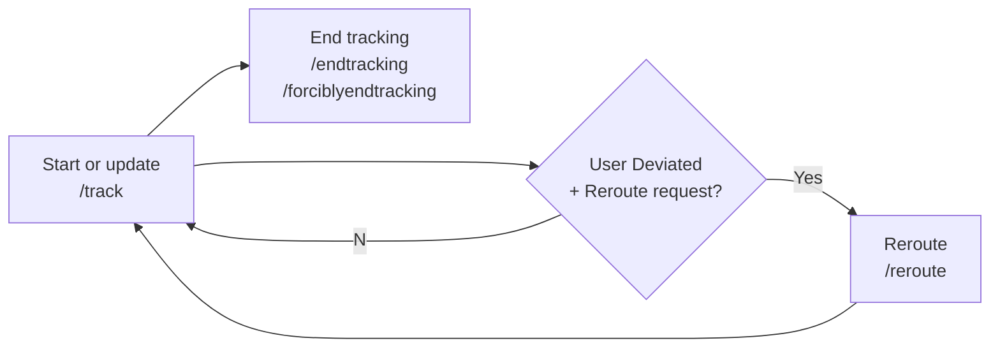
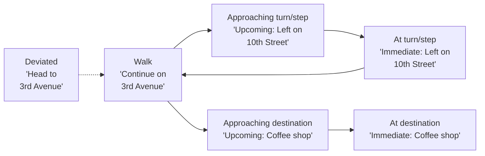

# OTP-middleware Live Tracking

This file provides an overview of live tracking in OTP-middleware.

## Overview

Live tracking keeps a record of a user's travel (or `TrackedJourney`) and provides location-based actions
as the user follows the itinerary saved in a `MonitoredTrip`.

## Tracked Journey Lifecycle

A `TrackedJourney` contains tracking information from the moment the journey is initiated until it is terminated.
While a `TrackedJourney` is active, successive locations of the person traveling are recorded.

A tracked journey's lifecycle is depicted in the diagram below, with the corresponding endpoints that are typically
called from a mobile app:


| Endpoint from `/api/secure/monitoredtrip` | Description |
| --- | --- |
| ~~`/starttracking`~~ | (Deprecated) Initiates the tracking of a monitored trip |
| ~~`/updatetracking`~~ | (Deprecated) Provides tracking updates on a monitored trip |
| `/track` | Starts or updates tracking on a monitored trip with an array of locations with timestamp |
| `/endtracking` | Terminates the tracking of a monitored trip by the user |
| `/forciblyendtracking` | Forcibly terminates tracking of a monitored trip by trip ID |
| `/reroute` | Reroute from the traveler's current location to the original trip destination |

## Traveler Status and Instructions

As the traveler's location is updated using the `/track` endpoint, the traveler status is computed,
with one of the following values stored in Mongo and returned to the caller (zoom as needed in map below):

| Status | Description |
| --- | --- |
| `DEVIATED` | Traveler is deviated, i.e. outside of the on-track boundary for the applicable mode on the path indicated by the `MonitoredTrip`'s itinerary. This is returned regardless of whether the traveler is ahead or behind schedule. |
| `ON_SCHEDULE` | Traveler is within the expected position boundary at the interpolated time for that position |
| `BEHIND_SCHEDULE` | Traveler's position is within the expected position boundary but at a time later than the expected, interpolated time for that position |
| `AHEAD_OF_SCHEDULE` | Traveler's position is within the expected position boundary but at a time before the expected, interpolated time for that position |

```geojson
{
  "type": "FeatureCollection",
  "features": [
    {
      "type": "Feature",
      "properties": {
        "text": "itinerary"
      },
      "geometry": {
        "type": "LineString",
        "coordinates": [
          [
            -83.992694,
            33.955927
          ],
          [
            -83.991702,
            33.95602
          ]
        ]
      }
    },
    {
      "type": "Feature",
      "properties": {
        "text": "On-track boundary"
      },
      "geometry": {
        "type": "Polygon",
        "coordinates": [
          [
            [
              -83.99271,
              33.956024
            ],
            [
              -83.992807,
              33.955976
            ],
            [
              -83.992796,
              33.955904
            ],
            [
              -83.992753,
              33.955851
            ],
            [
              -83.992662,
              33.955846
            ],
            [
              -83.991691,
              33.95594
            ],
            [
              -83.991616,
              33.95602
            ],
            [
              -83.991616,
              33.956087
            ],
            [
              -83.991707,
              33.956118
            ],
            [
              -83.991777,
              33.956118
            ],
            [
              -83.99271,
              33.956024
            ]
          ]
        ]
      }
    },
    {
      "type": "Feature",
      "properties": {
        "text": "On-track"
      },
      "geometry": {
        "type": "Point",
        "coordinates": [
          -83.992222,
          33.95602
        ]
      }
    },
    {
      "type": "Feature",
      "properties": {
        "text": "Deviated"
      },
      "geometry": {
        "type": "Point",
        "coordinates": [
          -83.992099,
          33.9557
        ]
      }
    }
  ]
}
```

Whether someone is deviated or not is determined by the following optional configuration parameters in `env.yml`:

| Parameter | Default value | Description |
| --- | --- | --- |
| `TRIP_TRACKING_WALK_ON_TRACK_RADIUS` | 5 | The threshold in meters below which walking is considered on track. |
| `TRIP_TRACKING_BICYCLE_ON_TRACK_RADIUS` | 10 | The threshold in meters below which cycling is considered on track. |
| `TRIP_TRACKING_BUS_ON_TRACK_RADIUS` | 20 | The threshold in meters below which travelling by bus is considered on track. |
| `TRIP_TRACKING_SUBWAY_ON_TRACK_RADIUS` | 100 | The threshold in meters below which travelling by subway is considered on track. |
| `TRIP_TRACKING_RAIL_ON_TRACK_RADIUS` | 200 | The threshold in meters below which travelling by rail is considered on track. |
| `TRIP_TRACKING_TRAM_ON_TRACK_RADIUS` | 100 | The threshold in meters below which travelling by tram is considered on track. |

Whether someone is on-time or not is determined by the timestamp of the last location in the `/track` payload
and by the following optional configuration parameters in `env.yml`. The longer the segment time,
the more tolerant the "on-time" determination is.

| Parameter | Default value | Description |
| --- | --- | --- |
| `TRIP_TRACKING_MINIMUM_SEGMENT_TIME` | 5 | The minimum segment size in seconds for interpolated points. |

## Turn-by-Turn Directions

Turn-by-turn directions sequence of notifications is as follows:



"Upcoming: Left/Immediate on 10th Street"
: Generated when a traveler approaches the next step in a leg. These steps are provided by OpenTripPlanner
with each walk/bicycle leg in an itinerary. This instruction is also provided when someone approaches the destination.

"Head to 3rd Avenue"
: If the traveler is deviated, they will be told to proceed to the street where they should be per the itinerary.

"Your destination is in the vicinity."
: Sometimes, there is no path in OpenStreetMap that leads to the exact destination of a leg or itinerary,
and travelers will be advised that their destination is in the vicinity.

How far in advance "upcoming" or "immediate" turn-by-turn instructions are generated is determined by the following
optional configuration parameters in `env.yml`:

| Parameter | Default value | Description |
| --- | --- | --- |
| TRIP_INSTRUCTION_IMMEDIATE_RADIUS | 2 | The radius in meters under which an immediate instruction is given. |
| TRIP_INSTRUCTION_UPCOMING_RADIUS | 10 | The radius in meters under which an upcoming instruction is given. |

## Transit Directions

The following directions can be produced while using public transportation:

"Wait 10 minutes for the bus..."
: Confirms arrival at the correct transit stop and provides an estimated wait time using real-time updates provided by OpenTripPlanner.
If it is past the departure time of the transit vehicle and no real-time updates are provided by OpenTripPlanner, "That time has passed" is also announced.

"Ride 6 stops / 15 minutes"
: When on board, and shortly after the transit vehicle departs, this instruction provides a summary of the trip on that vehicle.

"Your stop is upcoming..."
: This is an advance announcement (a few stops before the arrival stop) so that the traveler can prepare to leave the transit vehicle.

"Get off here..."
: Instructs the traveler to exit the transit vehicle at the current stop.

## Live Tracking Actions

OTP-middleware supports triggering certain actions during live tracking when someone reaches a location or is about to enter a path.
Actions include location-sensitive API calls to notify various services.
In the context of live trip tracking, actions may include notifying transit vehicle operators or triggering traffic signals.

### Location-Based Actions (`trip-actions.yml`)

Location-based trip actions are defined in the optional file `trip-actions.yml` in the same configuration folder as `env.yml`.
The file contains a list of actions defined by an ID, start and end coordinates, and a fully-qualified trigger class:

```yaml
- id: id1
  start:
    lat: 33.95684
    lon: -83.97971
  end:
    lat: 33.95653
    lon: -83.97973
  trigger: com.example.package.MyTriggerClass
- id: id2
  start:
    lat: 33.95584
    lon: -83.97871
  end:
    lat: 33.95553
    lon: -83.97873
  trigger: com.example.package.MyTriggerClass
...
```

Known trigger classes are in package `org.opentripplanner.middleware.triptracker.interactions`
and implement its `Interaction` interface.

| Class | Description |
| --- | --- |
| `UsGdotGwinnettTrafficSignalNotifier` | Remotely activates select pedestrian signals in Gwinnett County, GA, USA |

Location-based trip actions are triggered when someone is in the `TRIP_INSTRUCTION_IMMEDIATE_RADIUS` of
either the `start` or `end` location.

### Bus Notifier Actions (`bus-notifier-actions.yml`)

Bus notifier actions are defined in the optional file `bus-notifier-actions.yml` in the same configuration folder as `env.yml`.
The file contains a list of actions defined by an agency ID and a fully-qualified trigger class:

Bus notifications are currently sent when a traveler approaches a transit stop on a specific itinerary.

```yaml
- agencyId: id1
  trigger: com.example.package.MyTriggerClass
```

Known trigger classes below are in package `org.opentripplanner.middleware.triptracker.interactions.busnotifiers`
and implement its `BusOperatorInteraction` interface.

| Class | Description |
| --- | --- |
| `UsRideGwinnettNotifyBusOperator` | Notifies a bus driver on a specific trip in the RideGwinnett (Gwinnett County, GA, USA) service area |
